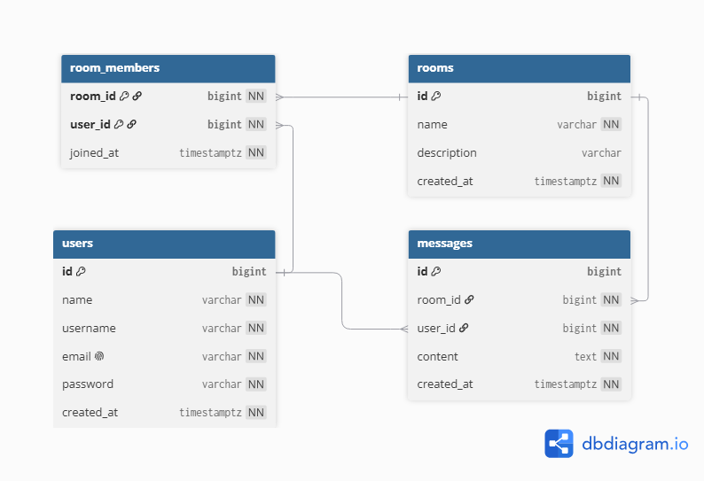
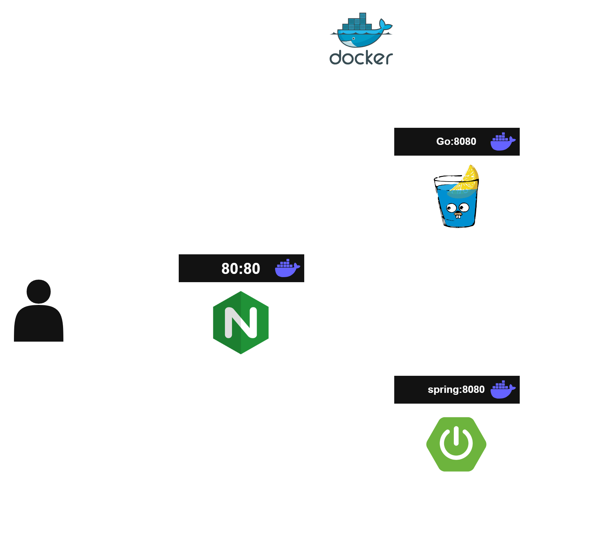

## 1. 프로젝트 개요
- 해당 프로젝트는 실시간 채팅 서비스로, 인증(Auth)과 실시간 통신(WebSocket) 영역을 각각 별도 서버로 아키텍처로 구성했습니다.

### 인증 서버(SpringAuth) - Spring Boot / Spring Security
- 회원가입, 로그인, JWT 발급 및 토큰 블랙리스트 관리 등 인증/인가 로직은 검증된 보안 표준인 **Spring Security**의 필터 체인, `UserDetailsService` 기반 인증 구조를 그대로 활용할 수 있어 Spring Boot로 구현했습니다.
- 인증 로직은 트래픽이 몰리는 실시간 통신과 달리 요청-응답 기반의 전형적인 CRUD/보안 처리에 가까워, 생산성과 생태계(라이브러리, 레퍼런스)가 풍부한 Spring Boot의 강점을 살리기 좋은 영역이라 판단했습니다.

### 실시간 채팅 서버(GoChat) - Go / WebSocket
- 채팅은 다수의 클라이언트가 장시간 커넥션을 유지하며 메시지를 주고받는 구조이기 때문에, 커넥션당 자원 소모가 적고 동시성 처리에 강한 Go의 **goroutine** 기반 모델이 적합하다고 판단했습니다.
- Hub/Room 구조로 커넥션을 관리하며 브로드캐스트를 처리하는데, Go의 가벼운 스레드 모델과 채널(channel)을 활용하면 별도의 스레드풀 관리 없이도 다수의 WebSocket 커넥션을 효율적으로 처리할 수 있습니다.
- 인증 서버(SpringAuth)에서 발급한 JWT를 GoChat의 미들웨어에서 검증하는 방식으로 두 서버를 연동하여, 인증 로직과 실시간 통신 로직의 책임을 분리했습니다.

## 2. ERD

## 3. 프로젝트 구조

## 4. 프로젝트 스택

| 구분 | 스택 |
| --- | --- |
| 인증 서버 (SpringAuth) | Java 21, Spring Boot 4.1.0, Spring Security, Spring Data JPA, JJWT 0.12.6 |
| 실시간 채팅 서버 (GoChat) | Go 1.25, Gin, coder/websocket, golang-jwt/jwt v5, pgx/v5, viper |
| 데이터베이스 | PostgreSQL |
| 인프라 | Docker, Docker Compose, Nginx (Reverse Proxy) |

## 5. 테스트 방법